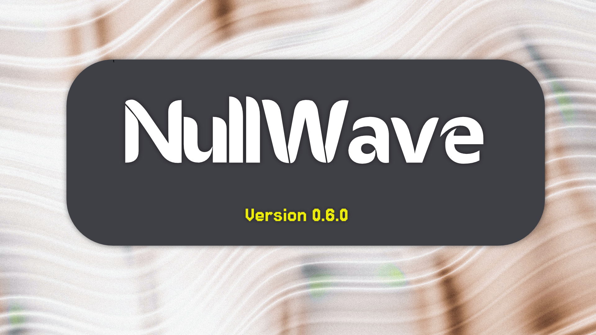

# 🎵 NullWave

<p align="center">
  
</p>

A personal music organizer with download, playback, and AI-powered smart sorting capabilities, built with C#/.NET 8 and Avalonia UI on Linux.

## Version

v0.6.1 "Oxeye Daisy" "Stability & Safety"

## About

NullWave lets you save, organize, download, and play music from YouTube, Last.fm, SoundCloud, and local files in one unified library. It features context-aware playlist generation using local weather and on-device AI. Organizer-first, player second.

> ⚠️ Please read [DISCLAIMER.md](DISCLAIMER.md) before using NullWave.

---

## Features

### 🧠 Smart Sorting (AI + Weather)

- **Auto-Mood Playlists**: Generates playlists based on your local weather (via OpenWeather API) and time of day.
- **Local AI Ranking**: Uses a local Ollama instance to rank tracks by suitability for the current mood.
- **Hardware Detection**: Automatically scans your CPU, RAM, and GPU VRAM to recommend and download the best AI model for your machine.
- **Last.fm Enrichment**: Automatically backfills missing genre tags and album art for your entire library on startup.

### 📚 Organizer

- Add tracks by URL (YouTube, Last.fm, SoundCloud) or local file
- Auto-fetch metadata from YouTube Data API v3 and Last.fm
- Read ID3 tags from local audio files (MP3, FLAC, WAV, OGG, M4A, AAC)
- Library with search, sort, favorites, play tracking, and queue
- **Multi-select bulk actions (Ctrl/Shift) with floating action bar**
- Bulk folder import with subfolder support and duplicate detection
- Track detail panel with editable title, artist, notes, and tags
- Playlist management and source filters (YouTube, Last.fm, SoundCloud, Local)

### 🎧 Player

- Local file playback via LibVLCSharp
- YouTube audio download via yt-dlp (to `~/.nullwave/downloads/`)
- YouTube and SoundCloud playlist import
- Audiobook mode: playback speed, resume-from-position, chapter navigation, sleep timer
- Live radio page with ICY metadata and station picker
- Dual-player crossfade (experimental, opt-in)
- **Sleep timer (15/30/45/60 min) with live mini-player countdown**
- Light / Dark / System theme modes
- Spotify-style now-playing bar with "Now Playing" accent indicators
- Shuffle, Repeat One, Repeat All, and Seek ±5 seconds
- Autoplay next track on finish

### 🎨 UI & Customization

- **Spotify-style Sidebar**: Collapsible rail mode (Ctrl+B), pinned playlists, playlist folders, and drag-and-drop reordering.
- **Live Theme Engine**: Light/Dark/System modes, 9 accent colors, 10 duotone pairs, 3 density styles, compact mode, and font scaling (zero restarts).
- **Profile Window**: Signed & computed badges, custom banner images, consolidated stats, and Install ID.
- **Localization**: Full English/Russian string tables with live language switching.
- **Onboarding Wizard**: First-run flow for theme, API keys, and download directory.
- **Smart Search**: Operators (`artist:`, `title:`, `tag:`, `is:favorite`, `-exclude`) for precise library filtering.
- **Mood Mix**: Weather-driven playlists (AI or tag-based) with auto-regeneration and pin preservation.

### 🛠️ Maintenance Suite

- Orphaned file sweep (dry-run preview + real deletion)
- Duplicate detection with smart keeper selection
- Link verification (stored metadata vs embedded tags)
- Path repair, asset reimport, and database vacuum optimization
- **Rolling auto-backups with retention and one-click restore from backup**

---

## Tech Stack

| Layer                | Technology                                      |
| -------------------- | ----------------------------------------------- |
| Language / Framework | C# 12, .NET 8, Avalonia UI 12 (MVVM)            |
| Playback             | LibVLCSharp + system libVLC                     |
| Download             | yt-dlp                                          |
| Metadata             | TagLib# (ID3), YouTube Data API v3, Last.fm API |
| Smart Sorting        | Ollama (Local AI), OpenWeather API              |
| Logging              | Serilog (3 sinks: system, user-actions, errors) |
| Security             | AES-256-GCM encrypted KeyStore                  |
| Persistence          | SQLite-net-pcl                                  |

---

## API Keys

Keys are stored encrypted at `~/.nullwave/keys.enc` - never in the project folder or git history. Manage them via **Settings → API Keys** inside the app, or set environment variables as fallback:

```bash
export NULLWAVE_YOUTUBE_KEY="your_key"
export NULLWAVE_LASTFM_KEY="your_key"
export NULLWAVE_OPENWEATHER_KEY="your_key"
```

---

## Requirements

- .NET 8 SDK
- libVLC - `sudo dnf install vlc-libs` (Fedora) or `sudo apt install libvlc-dev` (Debian/Ubuntu)
- yt-dlp - `pip install yt-dlp`
- node.js - `sudo dnf install nodejs`

**Windows note:** Requires .NET 8 SDK (or .NET 10 with `<RollForward>Major</RollForward>` in csproj). LibVLC native libraries auto-installed via NuGet. yt-dlp installed via winget.

**Fedora note:** libVLC installs to `/usr/lib64`. NullWave expects `/usr/lib`. Create symlinks:

```bash
sudo ln -s /usr/lib64/libvlc.so /usr/lib/libvlc.so
sudo ln -s /usr/lib64/libvlccore.so /usr/lib/libvlccore.so
```

---

## Building

```bash
git clone https://github.com/ZenQuantDev/NullWave.git
cd NullWave
dotnet build
dotnet run
```

---

## Data Directory

Everything NullWave writes lives under `~/.nullwave/`:

```
~/.nullwave/
  keys.enc          ← encrypted API keys
  profile.json      ← local user profile (username, bio, avatar path)
  avatar.png        ← profile picture
  library.db        ← SQLite music library
  downloads/        ← yt-dlp audio downloads
  art/              ← cached album art (YouTube thumbnails, SoundCloud covers)
  logs/
    NullWave-DDMMYYYY.log       ← all events
    UserActions-DDMMYYYY.log    ← user action log
    Errors-DDMMYYYY.log         ← errors with source attribution
```

---

## Project Structure

```
NullWave/
  Themes/               ← design system (Colors, Typography, Shapes, ControlStyles)
  Models/               ← Track, Playlist, UserProfile
  ViewModels/           ← MVVM ViewModels
  Views/
    Controls/           ← UserControls (Sidebar, MiniPlayer, TrackList, etc.)
  Services/             ← business logic (Library, Playback, Download, Metadata, etc.)
  Helpers/
    Logging/            ← NullActionLogger, NullWaveLogConfig
```

---

## Roadmap

See [ROADMAP.md](ROADMAP.md) for the full phased development plan.

---

## Author

ZenQuant

## License

MIT - see [LICENSE](LICENSE). See [DISCLAIMER.md](DISCLAIMER.md) for terms of use.
